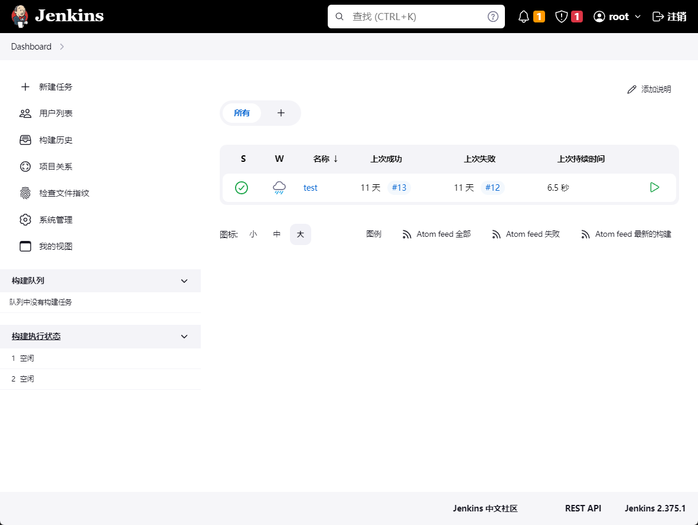
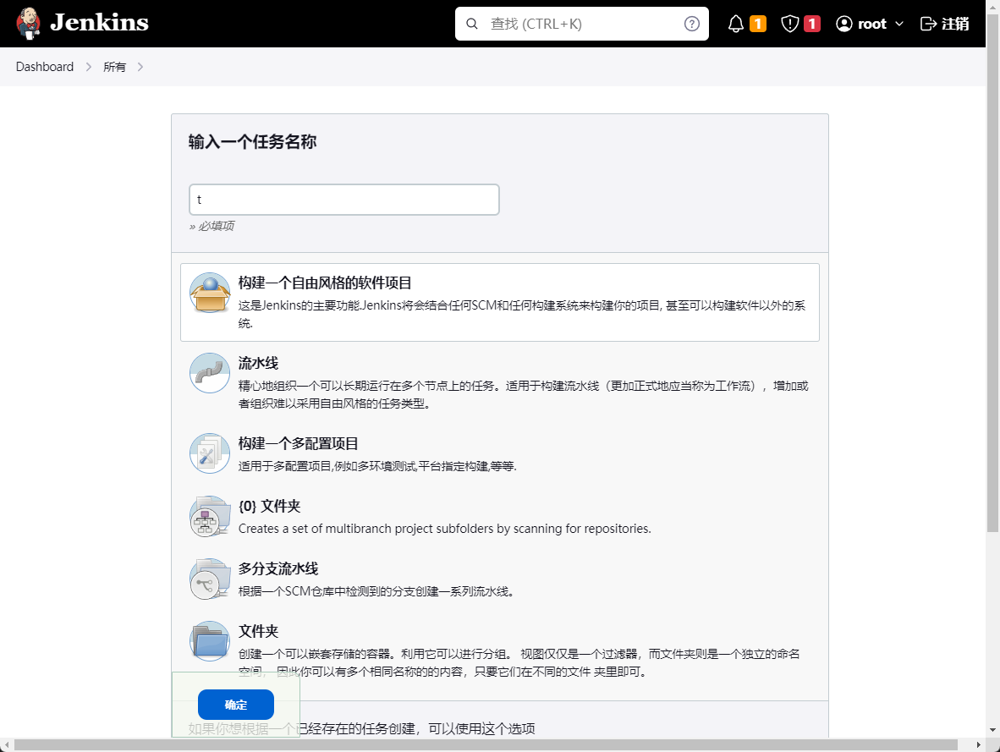
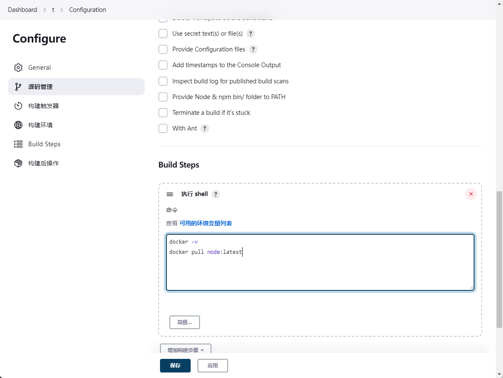
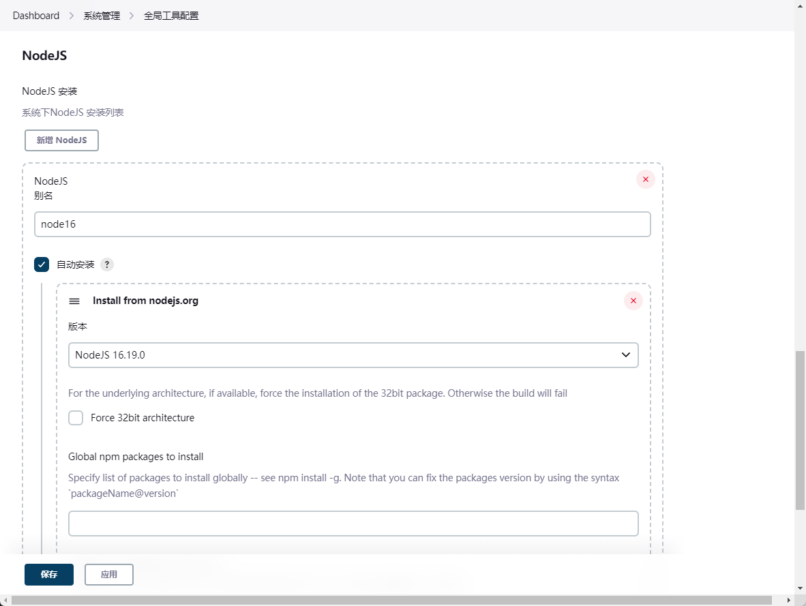
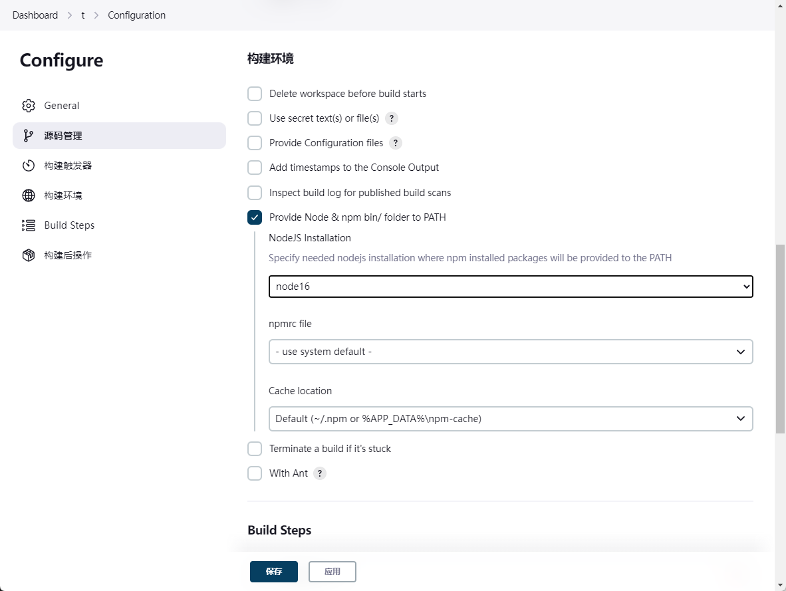

## 构建机


1. jenkins设置

此处省略第一次进入jenkins界面：输入密码 -> 安装推荐插件（太慢可以换源）-> 安装完成后进到主界面看到以下界面：




测试jenkins

新建任务 -> 任务名称随意 -> 选择第一项 -> 点击确定 创建任务



进入任务配置界面，拉到下面 Build Steps 选择增加构建步骤 -> 执行shell并输入以下内容
```shell
docker -v
docker pull node:latest
```


保存后点击立即构建，如果失败了提示权限问题，可能是因为Unix Socket 权限问题权限问题，可通过以下方式解决

```bash
# 将Jenkins用户添加到docker提供的用户组即可执行
sudo groupadd docker          #新增docker用户组
sudo gpasswd -a jenkins docker  #将当前用户添加至docker用户组
newgrp docker                 #更新docker用户组

# 重启jenkins 重启后重新构建即可
sudo service jenkins restart
```

2. 为jenkins安装node环境，如果当前服务器上有则不需要

通过jenkins插件的方式安装Nodejs。

安装完后，在全局工具配置中配置nodejs版本。


配置完后在任务设置中即可使用
  


3. SSH 协议集成 Git 仓库源

- 生成ssh公钥私钥，如果有则不用
- git远程仓库放公钥
- jenkins放私钥 （通过凭证设置添加）
- 任务配置 -> 源码管理选择git -> 填写git仓库 -> 选择Credentials(凭证)，通过ssh验证


4. 构建镜像

这里通过`Dockerfile`构建。 

在项目根目录创建 `Dockerfile`文件，内容如下

```Dockerfile 
# 注意如果没有这些目录需要去创建，否则执行命令时会报错
FROM nginx:1.15-alpine
COPY html /etc/nginx/html
COPY conf /etc/nginx/
WORKDIR /etc/nginx/html

# 通过docker build构建镜像
# docker build -t [imagename]:[version] .
```

推送到刚刚设置的git远程仓库
```git
git add ./Dockerfile
git commit -m "chore: add dockerfile"
git push
```

Jenkins 端配置，在刚刚的任务设置的shell脚本改为以下内容
```shell
#!/bin/sh -l

npm install --registry=https://registry.npm.taobao.org
npm run build
docker build -t jenkins-test .
```

点击立即构建，构建完成