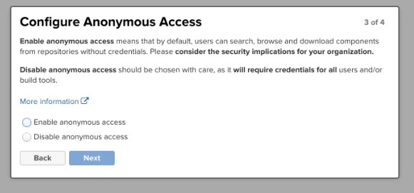
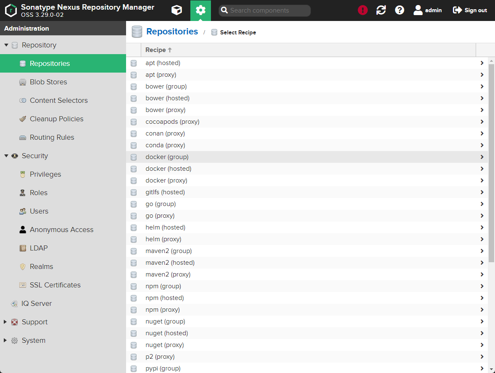
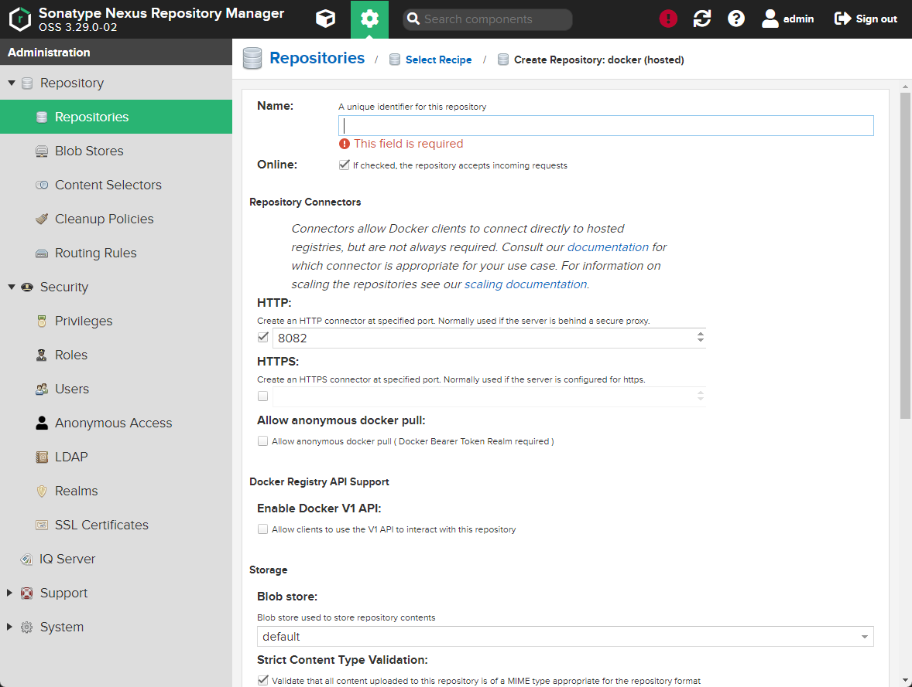
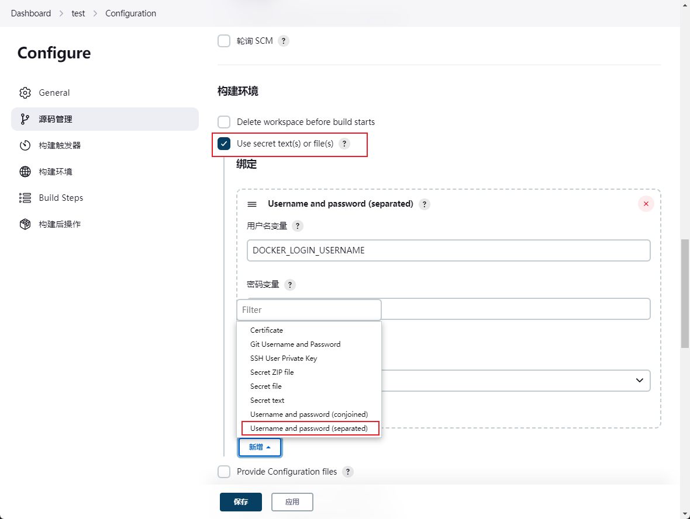
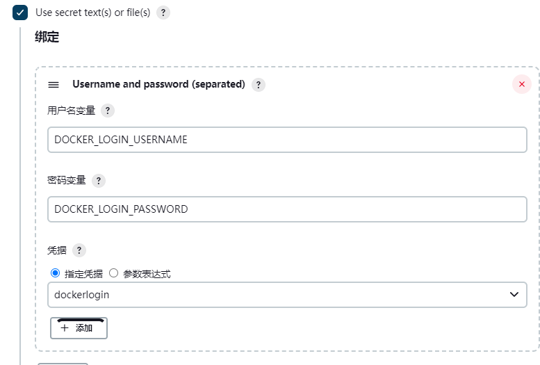

## 构建机

常用平台有Nexus，Jfrog，Harbor等

本次使用Nexus部署

1. Nexus安装

```bash
# 下载Nexus包
wget https://dependency-fe.oss-cn-beijing.aliyuncs.com/nexus-3.29.0-02-unix.tar.gz

# 解压
tar -zxvf ./nexus-3.29.0-02-unix.tar.gz

# 启动
cd nexus-3.29.0-02/bin
./nexus start

# 防火墙放行
firewall-cmd --zone=public --add-port=8081/tcp --permanent # 8081为nexus默认端口
firewall-cmd --zone=public --add-port=8082/tcp --permanent # 8082为开放给镜像库的端口
systemctl reload firewalld

# 安装完成后可访问 192.168.100.100:8081 
```

2. Nexus配置

访问 192.168.100.100:8081 登录，第一次登录密码在提示的文件中，登录后需要重置密码。

提示是否允许匿名访问（不npm login就可进行publish和install）,生产环境请不要开启，这里便于测试，我们开启，选择Enable anonymous access


创建一个Docker私服 点击`create repository`



- docker(proxy) 此类型制品库原则上只下载，不允许用户推送。可以理解为缓存外网制品的制品库。例如，我们在拉取 nginx 镜像时，如果通过 proxy 类型的制品库，则它会去创建时配置好的外网 docker 镜像源拉取（有点像 cnpm ）到自己的制品库，然后给你。第二次拉取，则不会从外网下载。起到 内网缓存 的作用。
- docker(hosted) 此类型制品库和 proxy 相反，原则上 只允许用户推送，不允许缓存。这里只存放自己的私有镜像或制品。
- docker(group) 此类型制品库可以将以上两种类型的制品库组合起来。组合后只访问 group 类型制品库，就都可以访问。

这里选择docker(hosted)方式，http端口填写刚刚前面防火墙放行的8082端口，点击确定创建




私服建设完成后，如果私服对外访问地址为HTTP的话，还需要在服务器配置一下才可以使用（HTTPS不需要配置）。  
找到 `daemon.json` 文件，该文件描述了当前 docker 配置的镜像加速地址，和配置过的私服地址。

```bash
vi /etc/docker/daemon.json
# 增加以下内容
{
  "insecure-registries" : [
    "192.168.100.100:8082"
  ],
}

# 重启docker
systemctl restart docker

# 登录docker
docker login 192.168.100.100:8082
```

登录成功后，就可以推送到镜像库了。在jenkins中修改shell命令。

```shell
#!/bin/sh -l

npm install --registry=https://registry.npm.taobao.org
npm run build
docker build -t 192.168.100.100:8082/jenkins-test .
docker push 192.168.100.100:8082/jenkins-test

```

但以上命令无法成功，因为没有登录docker账户，通过凭据来保存用户名密码

找到任务的设置界面 => 构建环境 => 勾选 Use secret text(s) or file(s) => 找到左下角的新增按钮，选择 Username and password (separated) 


确认后填写用户名及密码的变量名称



保存后就可以在shell中使用

```shell

npm install --registry=https://registry.npm.taobao.org
npm run build
docker build -t 192.168.100.100:8082/jenkins-test .
docker login -u $DOCKER_LOGIN_USERNAME -p $DOCKER_LOGIN_PASSWORD 192.168.100.100:8082
docker push 192.168.100.100:8082/jenkins-test
```

推送成功后，在nexus docker私服中就能看到推送的镜像